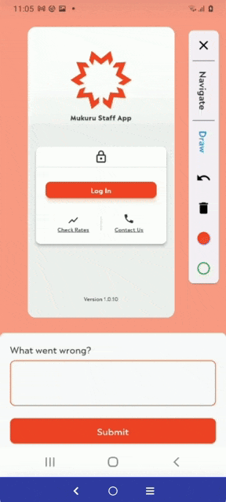

<p align="center">
  
</p>

<p align="center">
  <a href="https://pub.dev/packages/feedback"></a>
  <a href="https://github.com/ueman/feedback/actions/workflows/feedback.yml"></a>
  <a href="https://codecov.io/gh/ueman/feedback"></a>
  <a href="https://github.com/ueman#sponsor-me"></a>
  <a href="https://pub.dev/packages/feedback/score"></a>
  <a href="https://pub.dev/packages/feedback/score"></a>
  <a href="https://pub.dev/packages/feedback/score"></a>
</p>

---

💰 Using this library in a commercial product? Consider [becoming a sponsor](https://github.com/ueman#sponsor-me).

---

A Flutter package for obtaining better feedback. It allows the user to provide interactive feedback
directly in the app, by annotating a screenshot of the current page, as well as by adding text.

<p align="center">
  
</p>

## Mukuru Example

1. Add the dependency to your pubspec.yaml :

```
  feedback:
    git:
      url: https://github.com/MarnesFourie/feedback.git
      ref: master
      path: feedback
```

2. Import the package:
```
import 'package:feedback/feedback.dart';
```

3. Wrap your app with the BetterFeedback widget

```
void main() {
  runApp(

    //ADD THIS

    BetterFeedback(
      child: MyApp(),
    ),
  );
}

class MyApp extends StatelessWidget {
  @override
  Widget build(BuildContext context) {
    return MaterialApp(
      home: Scaffold(
        appBar: AppBar(
          title: Text('Welcome to Flutter'),
        ),
        body: Center(
          child: Text('Hello, World!'),
        ),
      ),
    );
  }
}
```

NOTE: Should you want to build a custom feedback form you are able to do so using the feedbackBuilder property

4. Create a class that manages when to show the feedback widget using BetterFeedback.of(context).show() AND what should happen with the result that is received from the feedback form. 

The following snippet is an example which :
 - Listens for a three finger gesture to then show the feedback form using BetterFeedback.of(context).show()
 - sends the result to Sentry
 - shows a snackbar message  for either a success or a failure

 NB : If you use this class, you need to add the Interaction Listener at the appropraite level in your widget tree to handle three finger gesture detection.


```

class InteractionListener extends StatelessWidget {
  final Widget child;
  final VoidCallback? onPointerUp;
  final GestureHandler gestureHandler = GestureHandler();

  InteractionListener({
    Key? key,
    required this.child,
    this.onPointerUp,
  }) : super(key: key);

  @override
  Widget build(BuildContext context) {
    return Listener(
      onPointerDown: gestureHandler.startPointerPosition,
      onPointerUp: (PointerUpEvent event) async {
        onPointerUp?.call();
        gestureHandler.endPointerPosition(event);
        if (gestureHandler.validateThreePointerGesture()) {

  // SHOW FEEDBACK FORM

          BetterFeedback.of(context).show((feedback) async {
          
  // USE THE RESULT

            final result = await _sendToSentry(feedback: feedback);

            locator<SnackbarService>().showCustomSnackBar(
              message: result == null
                  ? Strings.feedbackThankYouMessage
                  : Strings.feedbackErrorMessage,
              variant: result == null
                  ? SnackbarVarient.success
                  : SnackbarVarient.error,
              duration: const Duration(seconds: 3),
            );
          });
          gestureHandler.clear();
        }
      },
      onPointerCancel: (PointerCancelEvent event) {
        gestureHandler.clear();
      },
      child: child,
    );
  }
}

enum GestureState {
  idle,
  started,
  inProgress,
  ended,
}

class GestureHandler {
  Map<int, Offset> startingPositions = {};
  Map<int, Offset> endingPositions = {};
  GestureState state = GestureState.idle;

//Set the starting position of the finger that you are tracking
  void startPointerPosition(PointerDownEvent event) {
    if (state == GestureState.idle || state == GestureState.ended) {
      clear();
      state = GestureState.started;
    }
    startingPositions[event.pointer] = event.position;
  }

//Set the ending position of the finger that you are tracking.
  void endPointerPosition(PointerEvent event) {
    endingPositions[event.pointer] = event.position;
    if (startingPositions.length == endingPositions.length) {
      state = GestureState.ended;
    }
  }

//Reset the gesture detection
  void clear() {
    startingPositions.clear();
    endingPositions.clear();
    state = GestureState.idle;
  }

//A method that ensures three fingers were in fact used to swipe upwards for more than 50 pixels.
  bool validateThreePointerGesture() {
    if (state != GestureState.ended || endingPositions.length != 3) {
      return false;
    }
    for (var entry in startingPositions.entries) {
      final endPosition = endingPositions[entry.key];
      if (endPosition == null || !(entry.value.dy > endPosition.dy + 50)) {
        return false;
      }
    }
    return true;
  }
}

Future<String?> _sendToSentry({
  Hub? hub,
  String? name,
  String? email,
  required UserFeedback feedback,
}) async {
  try {
    final realHub = hub ?? HubAdapter();

    final id = await realHub.captureMessage(feedback.text, withScope: (scope) {
      scope.addAttachment(SentryAttachment.fromUint8List(
        feedback.screenshot,
        'screenshot.png',
        contentType: 'image/png',
      ));
    });
    await realHub.captureUserFeedback(SentryUserFeedback(
      eventId: id,
      email: email,
      name: name,
      comments: feedback.text,
    ));
    return null;
  } catch (e) {
    return 'Feedback not submitted';
  }
}


```

### Plugins

Depending on your use case there are wide variety of solutions.
These are a couple suggestions:

| Plugin               | Package                                                     |
| -------------------- | ----------------------------------------------------------- |
| GitLab Issue         | [feedback_gitlab](https://pub.dev/packages/feedback_gitlab) |
| Sentry User Feedback | [feedback_sentry](https://pub.dev/packages/feedback_sentry) |

| Target                          | Notes                                                                                                                                                                                                                                                 |
| ------------------------------- | ----------------------------------------------------------------------------------------------------------------------------------------------------------------------------------------------------------------------------------------------------- |
| Upload to a server              | To upload the feedback to a server you should use for example a [MultipartRequest](https://pub.dev/documentation/http/latest/http/MultipartRequest-class.html).                                                                                       |
| Share via platform share dialog | [share_plus on pub.dev](https://pub.dev/packages/share_plus). Also shown in the example.                                                                                                                                                              |
| Firebase                        | [Firestore](https://pub.dev/packages/cloud_firestore), [Cloud Storage](https://pub.dev/packages/firebase_storage), [Database](https://pub.dev/packages/firebase_database)                                                                             |
| Jira                            | Jira has a [REST API to create issues and upload files](https://developer.atlassian.com/server/jira/platform/jira-rest-api-examples/#creating-an-issue-examples)                                                                                      |
| Trello                          | Trello has a [REST API to create issues and upload files](https://developer.atlassian.com/cloud/trello/rest/api-group-actions/)                                                                                                                       |
| E-Mail                          | You can use the users email client like [in the sample app](https://github.com/ueman/feedback/blob/master/example/lib/main.dart) to send feedback to yourself using the [flutter_email_sender](https://pub.dev/packages/flutter_email_sender) plugin. |
